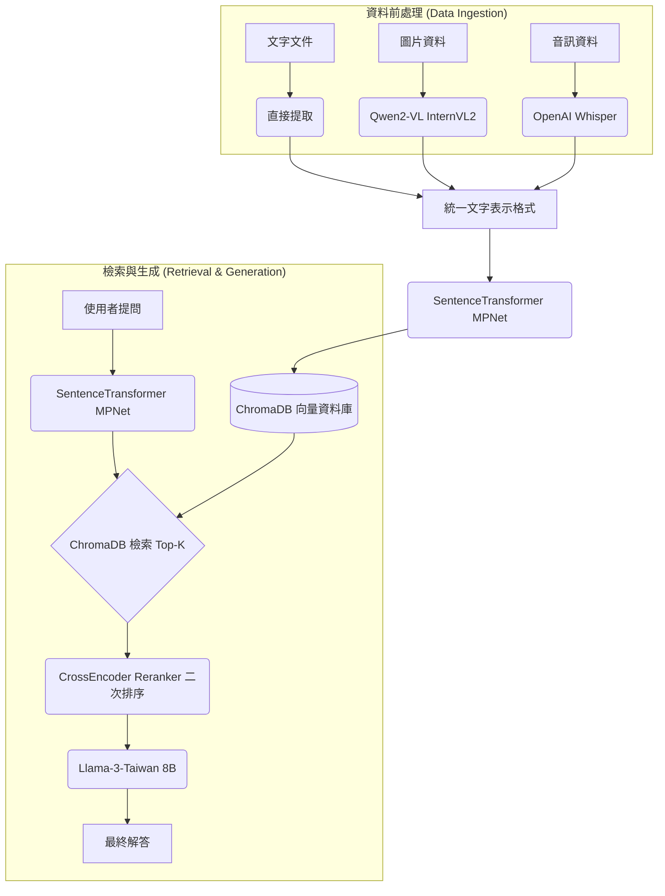

# 企業級多模態 RAG 系統 (Enterprise Multi-modal RAG System)

本專案是一個強健的企業級檢索增強生成 (Retrieval-Augmented Generation, RAG) 系統。本系統具備處理異質性資料來源（包含文字、圖片與音訊）的能力，能夠精準檢索相關背景資訊，並利用先進的本地端大型語言模型 (Local LLM) 生成準確的回答。

## 系統架構

## 系統特色

- 多模態資料處理：無縫處理標準文字，利用 Whisper 將音訊轉錄為文字，並透過 Qwen2-VL 萃取圖片中豐富的描述性資訊。
- 高精準度檢索機制：採用 `paraphrase-multilingual-mpnet-base-v2` 產生高密度語意向量，並導入 CrossEncoder (`ms-marco-MiniLM-L-6-v2`) 進行二次排序 (Reranking)，大幅確保檢索的準確性。
- 強健的自動化評估指標：內建自動化評估管線，可同步量測檢索層 (包含 Hit Rate, MRR, Precision) 以及生成層 (包含 ROUGE-L, BERTScore, Faithfulness) 的效能。
- 網頁介面與資料分析：提供基於 Gradio 的簡潔使用者介面，並支援查詢歷史自動紀錄 (JSONL 格式)，方便後續分析與稽核。

## 專案結構

- `src/processor.py`: 資料攝取與前處理模組。
- `src/vectorstore.py`: ChromaDB 資料庫與向量嵌入管理。
- `src/engine.py`: RAG 核心邏輯、二次排序與 LLM 推理生成。
- `src/evaluator.py`: 評估指標計算模組。
- `app.py`: Gradio 網頁介面啟動點。

## 效能評估報告

根據系統測試資料集，本系統在各項指標上的表現如下：

### 檢索指標 (Retrieval Metrics)
- Hit Rate@5: 1.000
- MRR@5: 0.850
- Precision@5: 0.200

### 生成指標 (Generation Metrics)
- ROUGE-L: 0.7200
- BERTScore F1: 0.8100
- Faithfulness: 0.9500
